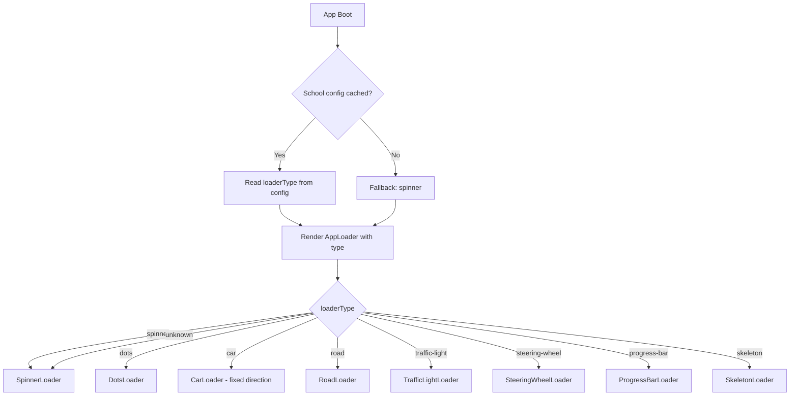
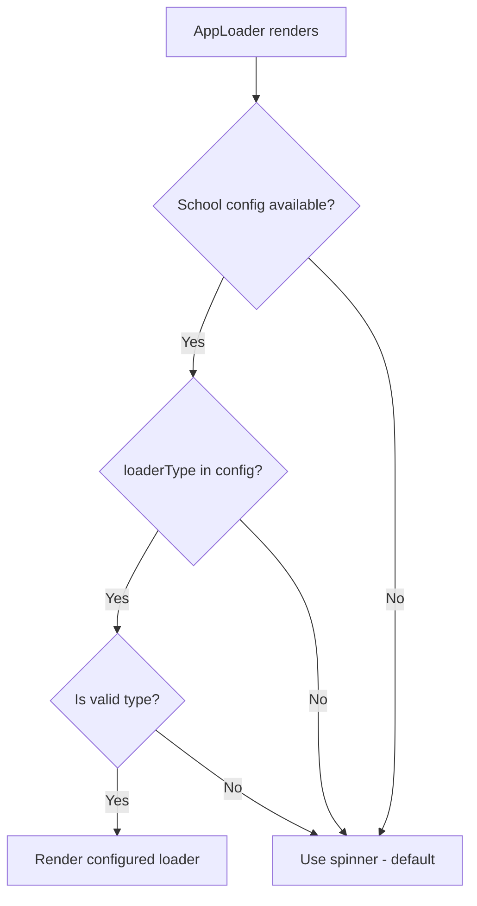

# Loader System Plan — Server-Configurable Boot Loaders

## Problem

1. **Car facing wrong way**: The current [`BootScreen()`](app/_layout.tsx:36) uses a 🚗 emoji that faces **left**, but the car animates **left-to-right** — making it look like it's driving backwards.
2. **Hardcoded loader**: The boot screen has a single hardcoded car-road animation. Different schools should be able to choose their preferred loader style from the server.
3. **No fallback**: If the config fails to load, there's no graceful fallback — the car animation always shows.

## Solution Overview

Create a **server-configurable loader system** where:
- The loader type is fetched from [`/api/app-config`](contexts/school-context.tsx:12) as part of the school branding config
- 8 predefined loader types are available
- A reusable [`AppLoader`] component renders the correct loader based on config
- Falls back to a clean **spinner** when config is unavailable



## Loader Types

| Type | Description | Animation |
|------|-------------|-----------|
| `spinner` | Classic spinning circle | Rotating ring with school primary color |
| `dots` | Pulsing dots sequence | 3 dots fading in/out sequentially |
| `car` | Car driving animation | Right-facing car with bounce, headlight glow |
| `road` | Moving dashed road | Dashed center line scrolling with progress fill |
| `traffic-light` | Red → yellow → green | Traffic light cycling through colors |
| `steering-wheel` | Spinning steering wheel | Rotating steering wheel emoji/icon |
| `progress-bar` | Horizontal fill bar | Smooth progress bar with shimmer |
| `skeleton` | Shimmer placeholder | Pulsing gradient shimmer blocks |

## Architecture

### File Structure

```
components/
  loaders/
    types.ts              # LoaderType union, LoaderProps interface
    SpinnerLoader.tsx      # Classic spinner
    DotsLoader.tsx         # Pulsing dots
    CarLoader.tsx          # Car animation (direction fixed)
    RoadLoader.tsx         # Road with dashes
    TrafficLightLoader.tsx # Traffic light sequence
    SteeringWheelLoader.tsx# Spinning wheel
    ProgressBarLoader.tsx  # Horizontal bar
    SkeletonLoader.tsx     # Shimmer blocks
    AppLoader.tsx          # Main component — picks loader by type
    index.ts               # Barrel export
```

### Type Changes

#### [`types/school-config.ts`](types/school-config.ts) — Add `loaderType` to `SchoolBranding`

```typescript
export interface SchoolBranding {
  logoUrl: string;
  iconUrl?: string;
  splashImageUrl?: string;
  schoolName: string;
  tagline?: string;
  loaderType?: LoaderType;  // NEW — server-configured loader style
}
```

#### `components/loaders/types.ts` — New file

```typescript
export type LoaderType =
  | 'spinner'
  | 'dots'
  | 'car'
  | 'road'
  | 'traffic-light'
  | 'steering-wheel'
  | 'progress-bar'
  | 'skeleton';

export interface LoaderProps {
  /** Primary color from school theme */
  color?: string;
  /** Size variant */
  size?: 'small' | 'medium' | 'large';
  /** Optional status text to display below the loader */
  statusText?: string;
  /** Progress value 0-1 for progress-based loaders */
  progress?: number;
}

export const DEFAULT_LOADER_TYPE: LoaderType = 'spinner';
```

### Component: `AppLoader`

The [`AppLoader`] component is the main entry point. It:
1. Reads `loaderType` from school config via [`useSchool()`](contexts/school-context.tsx:39)
2. Falls back to `spinner` if no config or unknown type
3. Passes school theme colors to the selected loader
4. Can be used standalone anywhere in the app

```typescript
// Usage in BootScreen:
<AppLoader statusText={BOOT_STEPS[statusIndex]} progress={progressValue} />

// Usage elsewhere in the app:
<AppLoader size="small" />
<AppLoader size="medium" color="#1B8FCE" />
```

### BootScreen Refactor

The current [`BootScreen()`](app/_layout.tsx:36) will be simplified:
- **Keep**: Logo, app name, tagline, background animation, status text
- **Replace**: The entire road/car/progress section (lines 213-275) with `<AppLoader />`
- **Keep**: The status text dots animation below the loader

The car-specific animations (`roadDashOffset`, `carBounce`, `headlightPulse`, road styles) will move into [`CarLoader`] and [`RoadLoader`] components.

### Car Direction Fix

The 🚗 emoji faces left on most platforms. Fix options:
1. **Use a right-facing car**: Some platforms support directional car emojis, but this is inconsistent
2. **CSS/RN transform flip**: Apply `transform: [{ scaleX: -1 }]` to mirror the emoji — this is the most reliable cross-platform approach
3. **Use a custom SVG/icon**: Replace emoji with a simple SVG car icon facing right

**Recommended**: Option 2 — `scaleX: -1` flip — simple, reliable, no new assets needed.

### Fallback Strategy



The spinner fallback ensures the app always has a clean loading state, even:
- On first launch before any config is fetched
- When offline with no cached config
- When the server returns an unknown loader type

## Implementation Steps

1. **Create `components/loaders/types.ts`** — Define `LoaderType` union and `LoaderProps` interface
2. **Create `SpinnerLoader.tsx`** — Clean animated spinner using `Animated.loop` rotation
3. **Create `DotsLoader.tsx`** — 3 dots with staggered opacity animation
4. **Create `CarLoader.tsx`** — Extract car animation from BootScreen, fix direction with `scaleX: -1`
5. **Create `RoadLoader.tsx`** — Extract road/progress animation from BootScreen
6. **Create `TrafficLightLoader.tsx`** — Three circles cycling red → yellow → green
7. **Create `SteeringWheelLoader.tsx`** — Rotating steering wheel emoji/icon
8. **Create `ProgressBarLoader.tsx`** — Simple horizontal progress bar with shimmer
9. **Create `SkeletonLoader.tsx`** — Shimmer placeholder blocks
10. **Create `AppLoader.tsx`** — Switch component that selects loader by type
11. **Create `index.ts`** — Barrel exports
12. **Update [`SchoolBranding`](types/school-config.ts:13)** — Add optional `loaderType` field
13. **Refactor [`BootScreen()`](app/_layout.tsx:36)** — Replace hardcoded car/road with `<AppLoader />`
14. **Clean up [`bootStyles`](app/_layout.tsx:460)** — Remove road/car-specific styles that moved to loader components

## Notes

- All loaders use React Native `Animated` API only — no third-party animation libraries needed
- Colors default to TFX blue (`#1B8FCE`) but accept school theme `primaryColor`
- The `progress` prop is optional — loaders that don't support progress ignore it
- Each loader is self-contained with its own styles and animations
